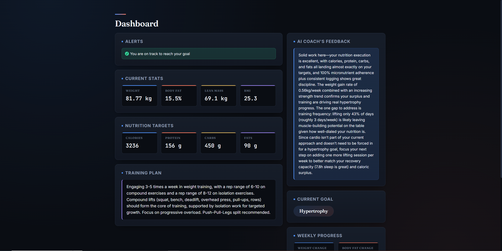
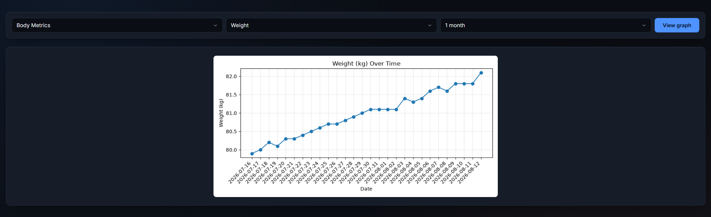

# Fitness Tracker
AI powered fitness tracking web app built with Flask and SQLite. Logs workouts, nutrition and body metrics, with Claude AI providing personalised feedback and natural language workout entry.

Add link here when website goes live after security checks

# Background
The project started as my A-Level Computer Science coursework. I have decided to revisit the idea and rewrite the original code, add new features and integrate AI features that are well suited to the concept. The core ideas and structures already exist speeding up the development process.

# What this project does
This project is a web based application that tracks the users fitness. The program calculates personalised targets to help the user reach their fitness goals. The user logs their data daily, which is stored in the database. Feedback is generated using built in algorithms and Claude AI by analysing the users progress. The user can view and understand their progress with dynamic graphs.

# Screenshots




# AI Features
* AI is used to parse user input about their workout by converting it into a JSON formatted string so the relevant data can be correctly stored in the database. (Claude Haiku 4.5)
* Information about the user and their progress is passed to AI along with a standard prompt to receive dynamic feedback on the user's progress. (Claude Sonnet 5)

# How to Run
1. Clone the repository and move into the project folder:
```bash
   git clone https://github.com/oscar-swan/fitness-tracker.git
   cd fitness-tracker
```
 
2. Create and activate a virtual environment:
```bash
   python -m venv .venv
   .venv\Scripts\activate    
```
 
3. Install dependencies:
```bash
   pip install -r requirements.txt
```
 
4. Create a `.env` file in the project root with:
```
   SECRET_KEY=your_secret_key_here
   ANTHROPIC_API_KEY=your_anthropic_api_key_here
```
 
5. Run the app:
```bash
   python run.py
```

# Technologies Used
- **Python 3**
- **Flask** 
- **SQLite3**
- **Anthropic Claude API** 
  - **Claude Haiku** for natural language workout parsing
  - **Claude Sonnet** for generating personalised feedback
- **Werkzeug security** for hashing user password
- **Matplotlib**
- **HTML/CSS/Jinja2** 

# Design Decisions

A lot of these decisions carry over from my A-level project, but the original implementations had bugs or didn't hold up once I started thinking about edge cases (users switching goals mid-way, sparse data, etc.), so most of this was rebuilt or rethought rather than copied over.

## Database Structure

- Added a goal set date so progress towards an old goal doesn't get counted towards a new one after the user changes targets.
- Added an account creation date for the same reason.
- Claude's feedback is generated once per day and cached in the database with a date stamp, not regenerated on every page load. If feedback already exists for today, it's just pulled from the database. This keeps AI usage low and stops feedback being generated every reload and wasting tokens.

## Demo Account Feature

This new addition lets a viewer explore the app with a full log history already populated, without needing to sign up and log their data for days first.

Demo account AI feedback isn't wiped on exit like the rest of the demo data is, so people can't spam generate AI calls by resetting it repeatedly.

## AI Integration

- Workout logging: AI parses natural language input, so the app doesn't need to contain every possible exercise name in a hardcoded list, and the user can just write about their workout instead of filling in boxes.
- Feedback: AI generated feedback is more personal and intuitive than the original alert only system from my original A-level version.

## Evaluating User Progress

The hardest design decisions came from figuring out how to fairly evaluate a user's data, especially for a user with limited history or one who does not log their data consistently.

### User Information for Claude
To let Claude assess progress accurately, a summary of the user's progress is created. Claude gets its generic instructions followed by:
- User's goal
- Average weekly weight and body fat changes
- Daily averages of diet intake and sleep time
- Whether strength, cardio intensity and cardio distance are increasing, decreasing or plateauing over time
- How frequently the user logs data and completes workouts
- The date the user selected their goal, plus their height, age, gender and weight
- Their actual diet targets, and how closely they've been hitting them

### Weekly Weight Change
Uses up to the most recent 3 weeks of data:
- Finds the change between week 1→2 averages and week 2→3 averages (each week's average = mean weight per day that week), then averages the two.
- With 14–20 days of data, it's just the week 1→2 difference.
- With fewer than 14 days, it calculates average daily change and multiplies by 7.

This lets the system produce an estimate with as little as 2 days of data, while getting more accurate as more data comes in.

### Body Fat Percentage Change
Same approach as weight change, adjusted for the fact that body fat percentage is logged weekly rather than daily.

### Diet and Sleep
Both evaluated as an average over the last 7 days, to reflect recent behaviour rather than the whole history.

### Strength Progress
The hardest algorithm to get right.
- An exercise is assessed once it's been logged at least twice (if within 70 days of a new goal) or 4 times (if on the same goal for 70+ days) this trades some accuracy for being able to analyse progress sooner.
- Caps at 6 entries per exercise so only recent history is used.
- Estimates 1RM from weight and reps for each session, then compares the most recent few 1RMs against the ones before that to judge direction. This means one bad session on a bad day doesn't make the program think you are not progressing.
- The ratio of exercises progressing vs regressing gives an overall score which signals that the metric is either declining, plateauing, or progressing.

### Cardio Progress
Same logic as strength used to judge whether intensity and distance covered are consistently trending up, down or plateauing.

### Calorie Adjustment System
A stored value that nudges the user's calorie target to better match their actual individual metabolism/activity over time.

If someone is hitting their calorie target but not seeing the expected effect on weight, the adjustment value shifts based on the size of that gap. It's timestamped and can only update every 14 days, so there's enough time to actually see whether the last change worked before updating again.

### Scientific Formulas Used
- BMI
- BMR
- TDEE
- Navy body fat percentage formula
- Epley's 1RM formula
- Formulas for predicting recommended macros based on the user's info

# Program in Practice
To be completed

# Evaluation
To be completed

# Potential Improvements
- AI could predict users strength / weight / muscle mass progress into the future
- Achievements or ranking system
- Ability to converse with the AI assistant
- Strength measured by a weight to 1RM ratio rather than just 1RM as strength appears to decrease with weight loss due to loss of leverage
- Encouraging popups and logging streaks
- Mobility goal for users attempting to regain or maintain their body mobility
- Limits in place on weight loss goals and minimum recommended calories to discourage unhealthy habits and prevent encouraging eating disorders
- Change calorie adjustment to a percentage based value so that it scales better

# AI Use in development
* The database initialiser code in db_init.py was generated by AI from an updated ERD diagram based on my original A-level project database structure, reflecting my new design decisions
* AI was used to generate code within seed.py and then edited manually to integrate into the program
* CSS within the program was generated by AI to match specific design choices, then manually tweaked to refine.
* AI was used throughout development to assist with debugging.